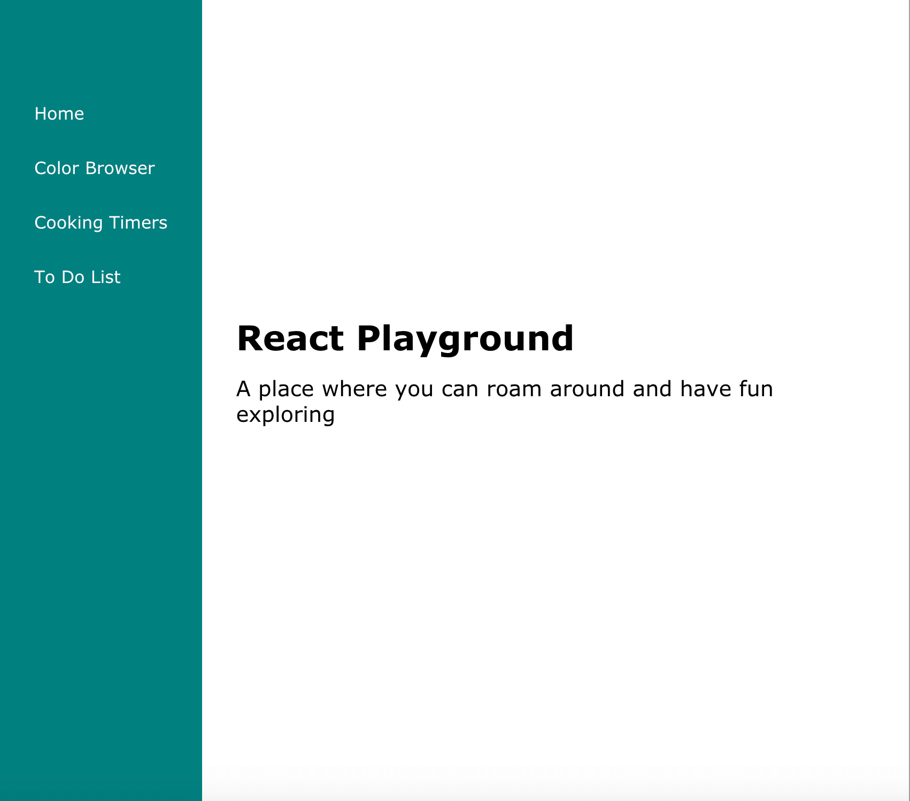
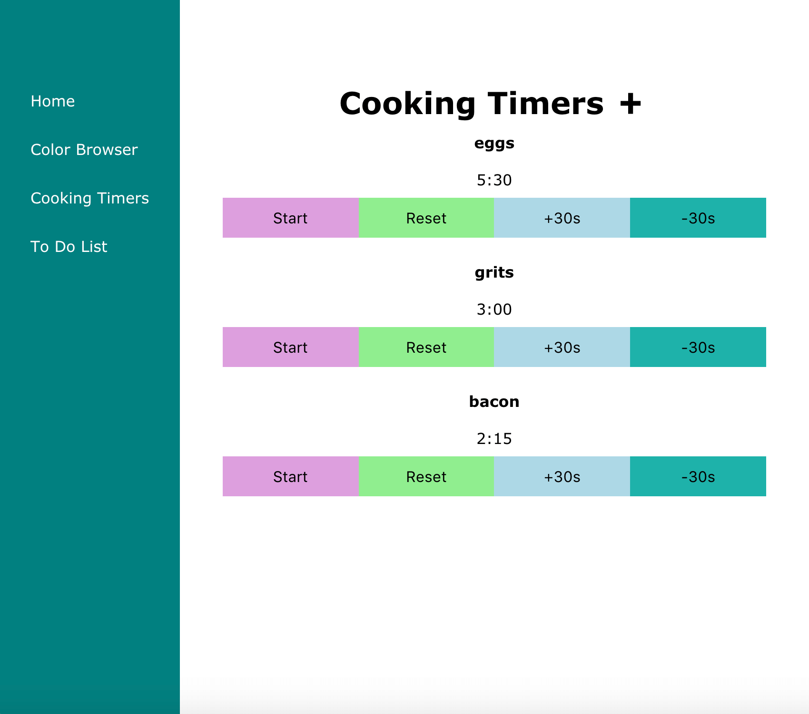

# React Playground

## Objective

Create an application where users can try out different mini apps.

Currently features 3 mini apps:

1) Color Browser
2) Cooking Timers
3) To Do List

I built this application as a way to learn React Hooks.

### Live Demo:

[React Playground](http://iamclamclam.com/react-playground/#/)

### Languages / Frameworks / Technologies used:

* HTML
* CSS / SASS
* JavaScript
* React / React Hooks

  

  
